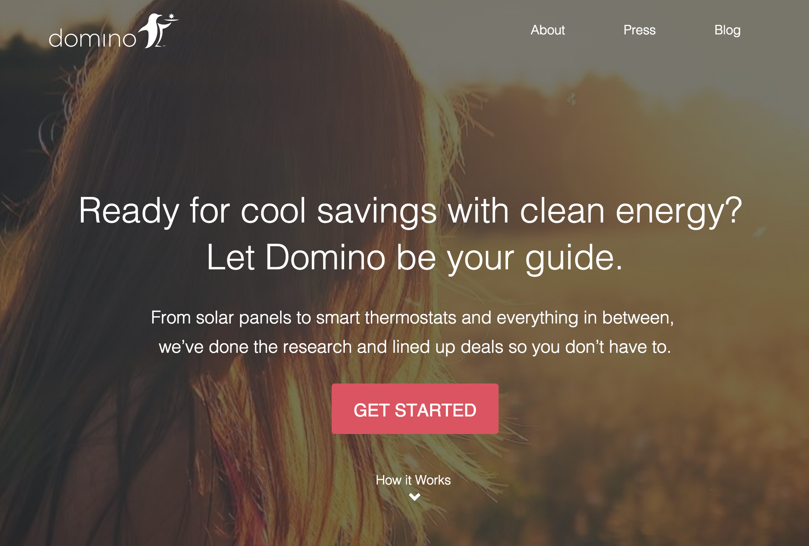

## Redesigning the company homepage through a design sprint exercise

### About
Our website was in need of an overhaul, so I took a inclusive approach to redesigning the website. I wanted to achieve two goals:

 1. Validate our assumptions on why lead conversion is low
 2. Update the visual design to match brand identity

 

## Day 1: Understanding

### Existing Solutions
I started the process by gathering competitor user flows and arranging them alongside our current design. This helped participants to start with shared understandings of the design context. This also helped to reduce repetitive ideas during the sketching exercises.

### Initial Testing
Before the design sprint, I also ran first-impression tests on the previous website. During the design sprint, the test results lent insight to how we could focus the improvement on our current design.

## Day 2: Sketching
Sketching is a practice that removes personal attachment to an idea and instead places it into a literal picture. People can then discuss an idea as a schematic rather than one owned by a person. This step also usually involves white-boarding the broader user story, which is then dissected for the current sprint. However, our goal had already been narrowed during Day 1, so we skipped the white-boarding.

### Crazy Eights to Storyboards
We used Crazy Eights as a rapid sketching exercise to get participants quickly cranking out ideas. We then created storyboards with our strongest ideas.

Crazy Eights

*Note: Getting people to sketch their ideas can be quite difficult. I did a test round as the first round of Crazy Eights, and it worked out really well. People often need to warm-up before diving in with pen and paper.*

Storyboards

<!-- 

 -->

## Day 3: Design

### Prototype

After sketching, we found a design flow that resonated with all us. We made an assumption that if users understood what we were offering, they would be more likely to become a lead. Our prototype consisted of a multi-step process that guides the user through questions. We found that this process would greatly inform and prepare concierges before they contact our users.

## Days 4 & 5: Testing & Learning

I took our prototype through a five-second test to evaluate people's impressions of the new website design. The results overwhelmingly supported our user assumption. For a more in-depth analysis, we quickly built a landing page. Here are some of our findings:

- 16% increase in conversion rate
- 10% decrease in bounce rate
- 63 second increase in completion time, but 2 times the leads.

## Design Sprint Wrap-Up

We spent the next week building out the sign-up flow for A/B testing. After evaluating our test results, we ended up using the prototype as our new homepage.

### Moving forward
We plan on building the interior pages (About, Press, Blog) and polishing small details (micro-interactions & edge cases) of the sign-up flow. Current work is confidential; please [contact me](mailto:jyng02@gmail.com) to find out more.
