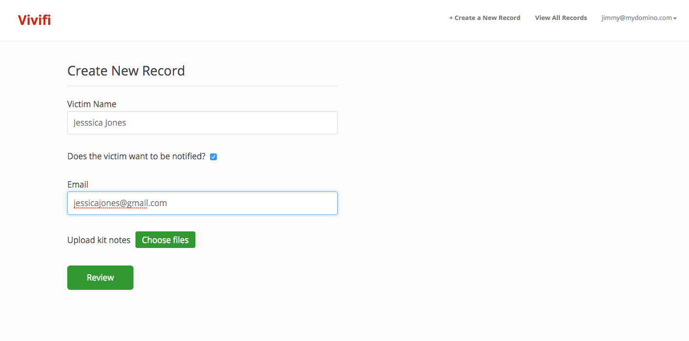
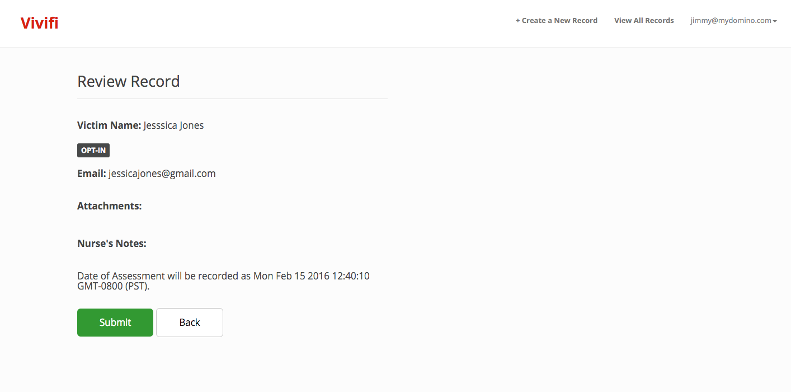
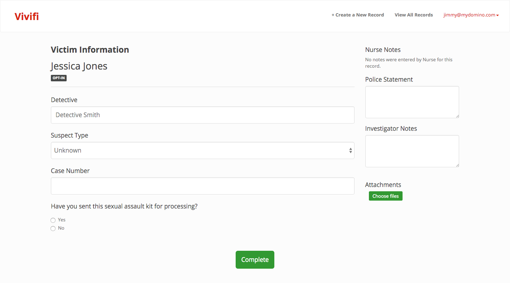


{{writing}}

## Problem

The process of putting together a sexual assault case currently fails the purposes of advocating for victims and bringing perpetrators to hand. This problem can be improved by building a better intake and management system. Here’s an overview of the current situation:

1. To initiate the case, the SANE (Sexual Assault Nurse Examiner) Nurse examines the victim. The results of the examination are sealed inside of a Sexual Assault Kit (SAK).
2. The SAK goes through a process of medical examination. The findings are meant to support the identification of perpetrator(s) and to provide evidence for a potential trial.
3. After the SAK gets processed, an investigator is assigned to pursue the case.
4. The investigator finds the perpetrator, brings them to trial, and concludes the case.

Sounds great, right? However, the reality is that investigators rarely get the necessary information to proceed with the case. There is always a large backlog of SAK that might never see an investigator.

## My Role
Because our team did a good amount of preliminary research, I was responsible for prioritizing product decisions, designing the product, and then implementing my designs in HTML/CSS.

## Sketching

I communicated the design through sketching first. This enables us to quickly draw out potential solutions while keeping design overhead low.
{{end_block}}

{{image-two}}

{{end_block}}
{{writing}}

## Solution

We determined that the biggest problem was how information was being distributed between professionals. Our proposed management system is aimed toward bridging the gaps between people and making the process as efficient as possible.
{{end_block}}
{{image-md}}

{{end_block}}
{{writing}}
### Creating a record

SANE Nurses initiate cases, but they have legal limitations on their access of information:

- They cannot edit the cases after it has been submitted

- They cannot view other cases

To account for these limitations, we decided to separate "SANE Nurse" and "Investigator" types where SANE Nurses can only create new records and Investigators can create and view records.
{{end_block}}
{{image-md}}

{{end_block}}
{{writing}}
Because SANE Nurses can only create new records, we have a “Review” button to help them confirm that they've entered the information accurately.
{{end_block}}
{{image-md}}

{{end_block}}
{{writing}}
### Investigating a case
After a case has been submitted, the case shows up on the dashboard (which only the investigator may see). The investigator can then proceed to look through each case and fill out the information they’ve collected. 
{{end_block}}
{{image-md}}

{{end_block}}
{{writing}}
Once an investigator presses “Complete,” an automated email message is sent to the victim to update them on the progress of their case.

## Conclusion
We built this project during a snowy weekend near Lake Tahoe, so it’s definitely a small application. Still, we solved our scope of the problem (increasing transparency of information) and even squeezed in a nifty feature (email updates).

## Reflections

#### Scope Creep
Scope creep is a huge issue in hackathon projects and often determines the success of the project. By using User Stories, the whole team is in sync with the product scope.

{{end_block}}
{{image-md}}

{{end_block}}
{{writing}}

For example, a user story we really wanted was for victim to use a dashboard to communicate with their investigator. This user story came up multiple times in conversation, but the size of the story was out of scope. We couldn't have a victim dashboard without an investigator dashboard. Building out a victim dashboard would require another weekend.

#### Designing in the Browser
When the team is small, it's crucial that team members have overlap. Designing in browser frees you from the ricochet of front-end feedback; increasing the velocity of the team.
I also find that once a designer has a deeper understanding of their material, they have better insight into the final product.
